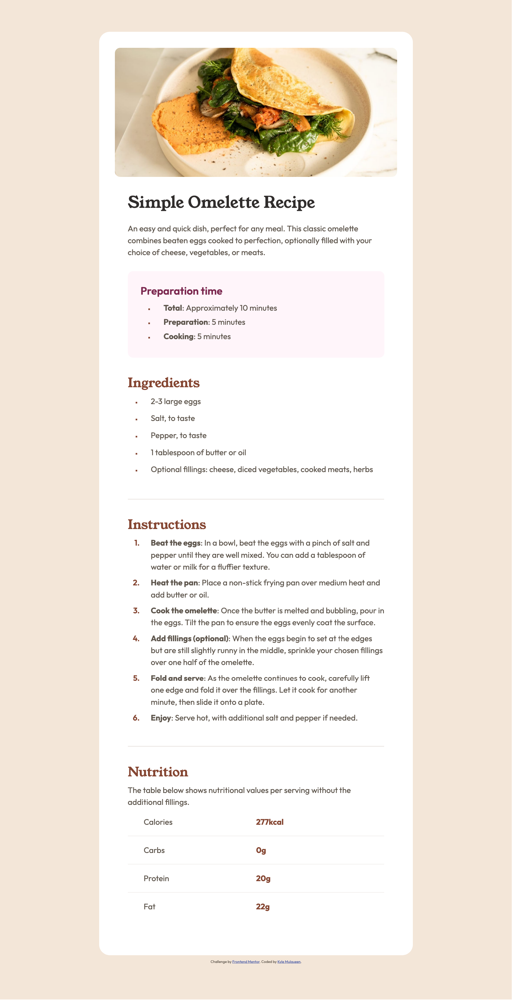
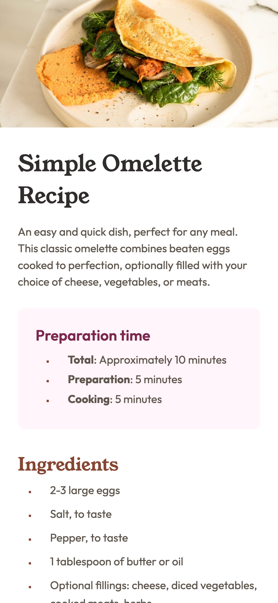

# Frontend Mentor - Recipe page solution

This is a solution to the [Recipe page challenge on Frontend Mentor](https://www.frontendmentor.io/challenges/recipe-page-KiTsR8QQKm). Frontend Mentor challenges help you improve your coding skills by building realistic projects.

## Table of contents

- [Frontend Mentor - Recipe page solution](#frontend-mentor---recipe-page-solution)
  - [Table of contents](#table-of-contents)
  - [Overview](#overview)
    - [Screenshot](#screenshot)
    - [Links](#links)
  - [My process](#my-process)
    - [Built with](#built-with)
    - [What I Learned](#what-i-learned)
      - [Semantic HTML Structure](#semantic-html-structure)
      - [Advanced List Styling](#advanced-list-styling)
      - [Proper Use of Description Lists](#proper-use-of-description-lists)
      - [CSS Positioning](#css-positioning)
    - [Continued Development](#continued-development)
    - [Useful resources](#useful-resources)
  - [Author](#author)

## Overview

### Screenshot


**Desktop solution**


**Mobile solution**

### Links

- Solution URL: [GitHub Pages](https://kmulqueen.github.io/recipe-page-challenge/)

## My process

### Built with

- Semantic HTML5 markup
- CSS custom properties
- Flexbox
- CSS Grid
- Mobile-first workflow

### What I Learned

While working on this recipe page, I gained valuable insights into semantic HTML and CSS styling techniques:

#### Semantic HTML Structure

I learned the importance of using proper HTML elements to create a meaningful document structure:

```html
<article class="recipe">
  <header class="recipe-info">
    <h1 class="recipe-title">Simple Omelette Recipe</h1>
    <!-- Description -->
  </header>
  <section class="recipe-ingredients">
    <!-- Content -->
  </section>
</article>
```

#### Advanced List Styling

I discovered how to properly style ordered lists with custom counters while maintaining accessibility:

```css
ol {
  padding-left: 1.5em;
  counter-reset: item;
}

ol > li {
  position: relative;
  padding-left: 1.4em;
  list-style-type: none;
}

ol > li::before {
  content: counter(item) ".";
  counter-increment: item;
  position: absolute;
  left: -1.5em;
  text-align: right;
  width: 1.5em;
  color: var(--color-brown-800);
}
```

#### Proper Use of Description Lists

I learned how to structure nutritional information semantically using description lists:

```html
<dl>
  <div class="nutrition-item">
    <dt>Calories</dt>
    <dd>277kcal</dd>
  </div>
  <!-- More nutrition items -->
</dl>
```

#### CSS Positioning

I learned how to use absolute positioning for properly aligning list markers and maintaining text alignment on wrapped text.

### Continued Development

For future projects, I want to focus on:

1. **Responsive Design Techniques** - While I implemented basic responsiveness, I want to explore more advanced approaches like CSS Grid and modern layout techniques.

2. **CSS Custom Properties** - I started using CSS variables for colors, but I want to expand my use of custom properties for spacing, typography, and other repeated values.

3. **Accessibility Beyond Semantics** - I focused on semantic HTML, but I want to enhance my projects with ARIA attributes, keyboard navigation, and more comprehensive accessibility features.

4. **Advanced CSS Selectors** - I want to improve my knowledge of complex CSS selectors to write more efficient and maintainable CSS.

5. **CSS Animation** - Adding subtle animations could enhance the user experience in future projects.

### Useful resources

- [MDN HTML Docs](https://developer.mozilla.org/en-US/docs/Web/HTML) - This helped me find the appropriate semantic HTML elements that should be used (such as `<b>` and `<dl>`). I really learned a lot about different elements from this website will use it going forward.

## Author

- Website - [Kyle Mulqueen](https://kmulqueen.github.io/portfolio-2025/)
- Frontend Mentor - [@kmulqueen](https://www.frontendmentor.io/profile/kmulqueen)
